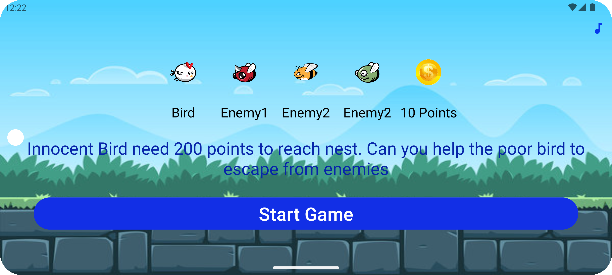
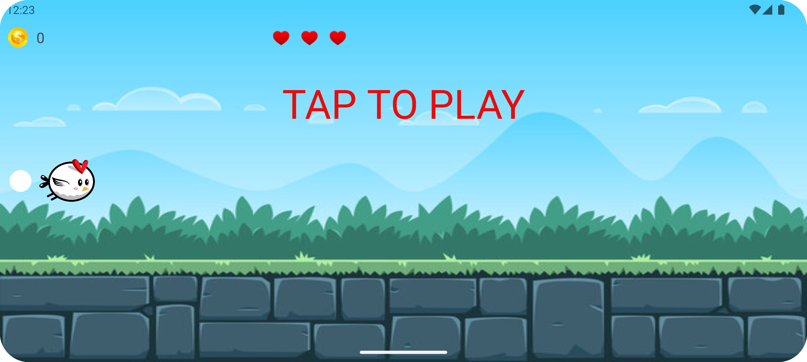
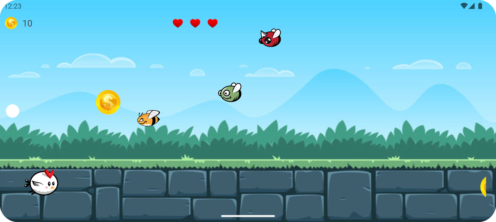
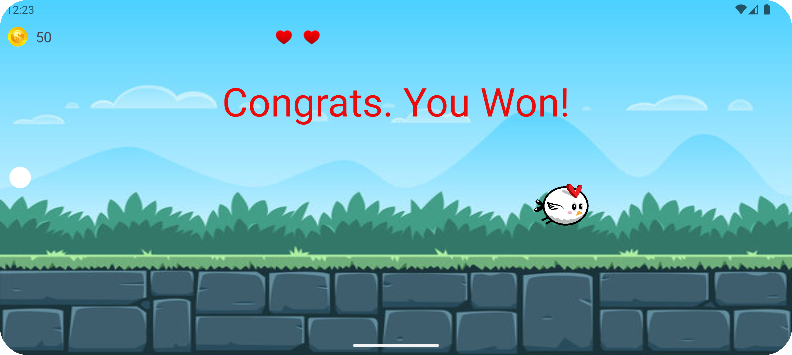
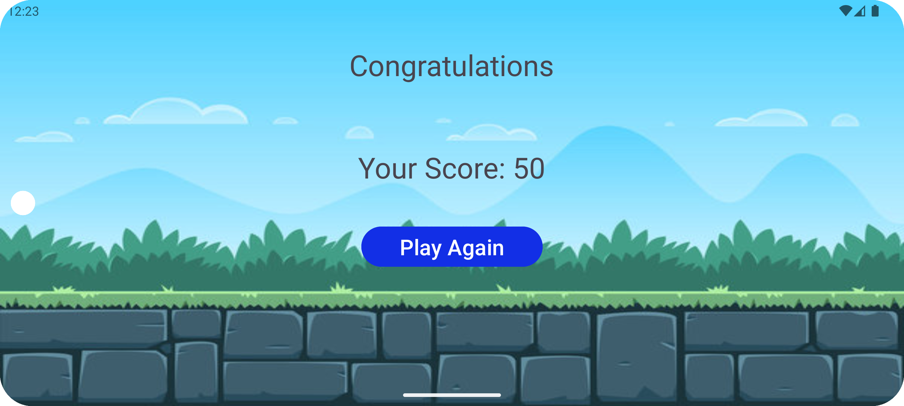

<h1 style="font-size:48px;">BirdGame</h1>

BirdGame is an engaging and addictive Android game where players control a bird to navigate through various obstacles. It's a simple yet challenging game designed to test your reflexes and timing.

<h2 style="font-size:36px;">🌟 Features</h2>

- 🐦 Intuitive Controls: Easy to learn, hard to master controls.

- 🌸 Beautiful Graphics: Stunning visuals and smooth animations.

- 🎮 Challenging Gameplay: Navigate through obstacles and achieve high scores.

- 🌐 Global Leaderboard: Compete with players around the world.

<h2 style="font-size:36px;">📦 Installation</h2>

- Clone the repository: git clone https://github.com/divyam082003/birdgame.git

<h2 style="font-size:36px;">Screenshots</h2>

  
  
  
  
  

